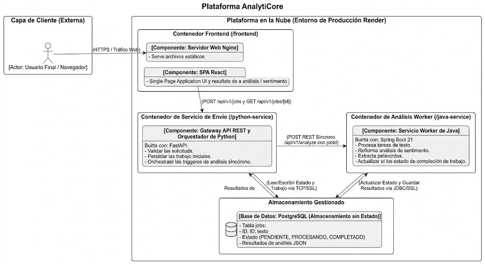
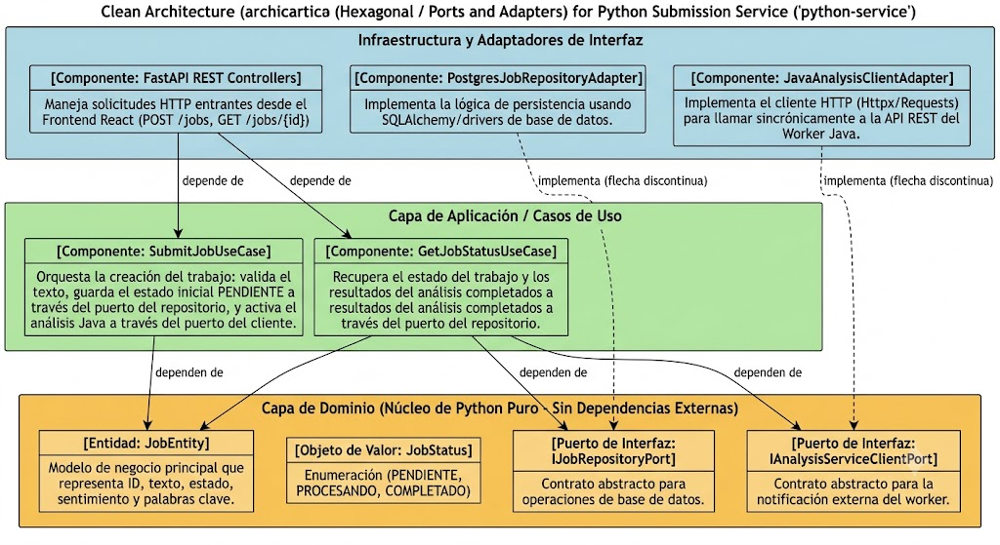
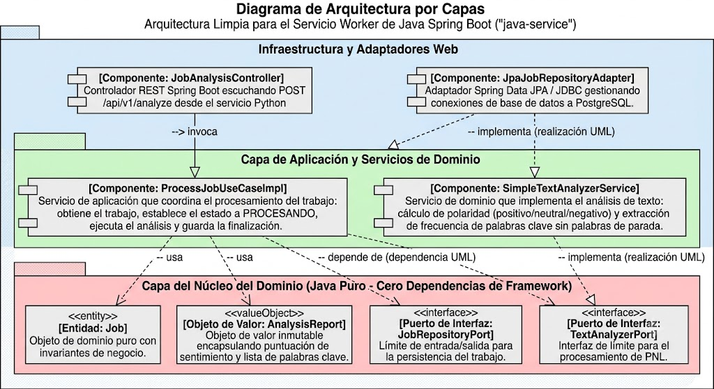
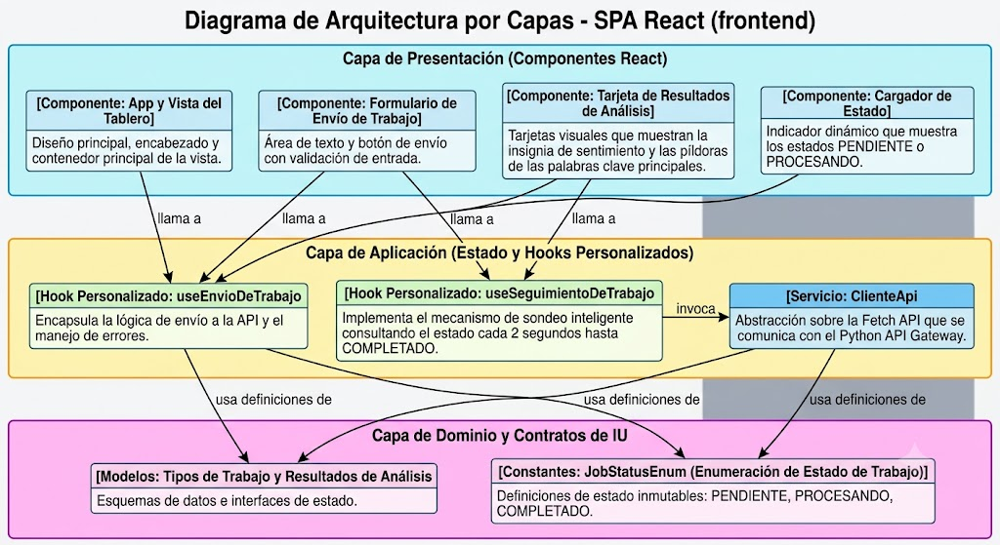

# AnalytiCore Platform - Prototipo de Arquitectura Orientada a Servicios en la Nube

**AnalytiCore** es un prototipo funcional cloud-native políglota desarrollado para demostrar la viabilidad técnica de una arquitectura orientada a servicios (SOA) contenerizada en **Docker**, con persistencia externa **Stateless en PostgreSQL**, comunicación estrictamente **RESTful** y adhesión rigurosa al patrón de **Arquitectura Limpia (Clean Architecture)** en cada uno de sus componentes.

---

## 📦 Entregables del Repositorio (Según Rúbrica)

El repositorio cumple con la estructura exacta solicitada:

### 1. Código Fuente & Dockerfiles
*   **`/frontend`**: Aplicación de Página Única (SPA) en React + Vite + Nginx. Contiene el archivo `Dockerfile` en su raíz configurado para compilación en múltiples etapas (*multi-stage build*).
*   **`/python-service`**: Servicio de Submisión web orquestador en Python 3.11 + FastAPI bajo Arquitectura Limpia. Contiene el archivo `Dockerfile` en su raíz.
*   **`/java-service`**: Servicio Worker de Análisis NLP en Java 21 + Spring Boot 3 bajo Arquitectura Limpia. Contiene el archivo `Dockerfile` (*multi-stage build*) en su raíz.

---

### 2. Diagrama de Componentes (Arquitectura General y Contenedores)
El diagrama muestra los contenedores Docker independientes, el servidor Nginx, las comunicaciones mediante APIs REST y el almacenamiento externo en la base de datos gestionada PostgreSQL:



---

### 3. Diagramas de Capas (Arquitectura Limpia por Componente)

Para cada uno de los 3 componentes se detalla su arquitectura interna respetando la **Regla de Dependencia** (las dependencias apuntan hacia la Capa de Dominio central):

#### 🐍 Servicio de Submisión (`python-service`)


#### ☕ Servicio de Análisis Worker (`java-service`)


#### 🌐 Frontend Web (`frontend`)


---

### 4. Informe Ejecutivo
El documento completo con la extensión máxima exigida (1 página) justificando el problema de negocio, la propuesta técnica, la escalabilidad elástica, la mantenibilidad de la Arquitectura Limpia y los beneficios de usar equipos políglotas se encuentra en:
👉 **[`docs/informe_ejecutivo.md`](docs/informe_ejecutivo.md)**

---

## 🔁 Flujo de Datos del Sistema

1. **Usuario -> Frontend (`/frontend`):** El usuario introduce un texto en la interfaz visual servida por Nginx y hace clic en iniciar análisis.
2. **Frontend -> API REST -> Servicio de Submisión (`/python-service`):**
   - El servicio Python valida la solicitud, crea un registro en la base de datos con estado `"PENDIENTE"` y llama de forma **síncrona** a la API REST del servicio Java worker notificando la disponibilidad del nuevo trabajo.
   - Retorna de inmediato el identificador `jobId` al frontend para evitar bloqueos del cliente.
3. **Servicio de Análisis (`/java-service`) <-> PostgreSQL:**
   - El worker Java toma el trabajo en segundo plano, actualiza el estado en PostgreSQL a `"PROCESANDO"`.
   - Ejecuta el análisis de sentimiento (cálculo de polaridad y conteo de palabras positivas/negativas) y la extracción de palabras clave más frecuentes por TF (descartando stopwords).
   - Guarda el reporte JSON final y cambia el estado a `"COMPLETADO"`.
4. **Frontend <-> Servicio de Submisión:**
   - El frontend realiza consultas periódicas (*polling* inteligente cada 2 segundos) al endpoint `GET /api/v1/jobs/{jobId}` del servicio Python hasta recibir `"COMPLETADO"` y mostrar el dashboard visual con los resultados.

---

## 🚀 Instrucciones de Ejecución Local (Docker Compose)

Para levantar el prototipo completo localmente:

1. Abre la terminal en el directorio raíz del proyecto:
   ```bash
   docker-compose up --build -d
   ```
2. Accede a las interfaces:
   - **Frontend Web (React):** [http://localhost](http://localhost) (o puerto 80)
   - **Python API Gateway (Swagger UI):** [http://localhost:8000/docs](http://localhost:8000/docs)
   - **Java Worker Health Check:** [http://localhost:8081/api/v1/analyze/health](http://localhost:8081/api/v1/analyze/health)
